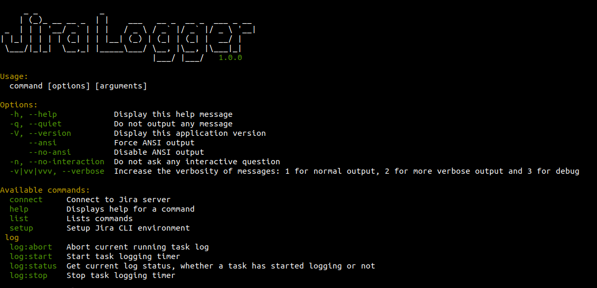

# Jira Logger
>A command line tool to automate Jira logging


## Table of Content
* [Installation](#installation)
    * [Regular](#regular)
    * [Docker](#docker)
* [Usage](#usage)
    * [Setup](#setup-command)
    * [Timezone](#timezone-command)
    * [Connect](#connect-command)
    * [Start](#start-command)
    * [Stop](#stop-command)
    * [Status](#status-command)
    * [Abort](#abort-command)
    * [Sync](#sync-command)
    * [Tempo](#tempo)
        * [Attributes](#attributes-command)
        * [List](#attributes-list-command)
* Testing
* [Contributing](#contributing)
* [License](#license)
* [Change Logs](#changelog)

## Installation
### Regular
- Pre-requisites
    - PHP version >= 7.2
    - PHP SQLite extension
    - [Composer](https://getcomposer.org) package manager
- Run the following commands to get the Jira logger project
```bash
composer create-project mohamed-abdul-fattah/jira-logger
cd jira-logger
# List Jira logger commands
php jiralogger list
```

### Docker
- Pre-requisites
    - Install [Docker](https://docs.docker.com/install/) locally
    - [Composer](https://getcomposer.org) package manager
- Run the following commands to setup Jira logger via docker
```bash
composer create-project mohamed-abdul-fattah/jira-logger
cd jira-logger
docker-compose up -d
# Use the following command to interacte with the jiralogger
# through the docker container
docker exec -it jiralogger-cli php jiralogger
```

## Usage
### Setup Command
`setup` command should be run once at the setup of the command line tool 
to create the database and request for your Jira server URI.
```bash
# https://jira.com/ is an example of your Jira server URI
php jiralogger setup https://jira.com/
```

### Timezone Command
Use `config:timezone` command to configure the start and end log time timezone
```bash
php jiralogger config:timezone
# Choose between UTC and Africa/Cairo timezones
```

### Connect Command
`connect` command is your way for authentication with your Jira server. 
Authentication is needed for logs syncing process.
```bash
# This way, connect command will ask for your Jira username and password
php jiralogger connect

# You can provide username via command options
php jiralogger connect -u john.doe
```

### Start Command
Use `log:start` command to start a logging timer for a Jira task.
```bash
# Running start with task ID would start with "now" time
php jiralogger log:start TASK-123

# Optionally, you can provide log starting time and log description
php jiralogger log:start TASK-123 -t 13:20 -d "Work in progress"
```
Using tempo add-on for logging with custom attributes (visit [tempo](#tempo) section for more information)
can be handled with the `group` option. Refer to [tempo attributes](#attributes-command) for more information about custom attributes.
```bash
php jiralogger log:start TASK-123 -g groupname
```

### Stop Command
Use `log:stop` command to stop a logging timer for a Jira task.
```bash
# Running stop will stop task at "now" time
php jiralogger log:stop

# Optionally, you can provide end time and override starting description
php jiralogger log:stop -t 15:30 -d "DONE"
```
Using tempo add-on for logging with custom attributes (visit [tempo](#tempo) section for more information)
can be handled with the `group` option. Refer to [tempo attributes](#attributes-command) for more information about custom attributes.
```bash
# Override provided tempo group on log:start
php jiralogger log:stop -g groupname
```

### Status Command
Use `log:status` command to get the current running task information if any,
and the total un-synced logs items.
```bash
php jiralogger log:status
```

### Abort Command
Use `log:abort` command to abort a logging timer for a started Jira task.
```bash
php jiralogger log:abort
```

### Sync Command
Use `log:sync` command to sync and log times to Jira tasks. 
Requires authentication (via [`connect`](#connect-command) command)
```bash
php jiralogger log:sync
```

### Tempo
[Tempo](https://www.tempo.io/) is a Jira add-on for better time tracking and reports.
Before using Tempo features, check with your admin whether it is installed on your Jira server or not.

#### Attributes Command
Use `tempo:attributes` to save custom attributes added by your Jira admin.
```bash
php jiralogger tempo:attributes '{"attributes":{"_Role_":{"name":"Role","value":"Developer"}}}'
```
By default, attributes are saved under `default` group name.
While you can provide different attributes with different group names.
```bash
php jiralogger tempo:attributes '{"attributes":{"_Role_":{"name":"Role","value":"Developer"}}}' -g mygroup
```

#### Attributes List Command
Use `tempo:list` to list the saved attributes by [`tempo:attributes`](#attributes-command)
```bash
php jiralogger tempo:list
```

## Contributing
Please, read [CONTRIBUTING.md](/CONTRIBUTING.md) for details on the process of submitting pull requests to us.

## License
This project is licensed under the MIT License - see the [LICENSE](/LICENSE) file for details

## ChangeLog
Please, read the [CHANGELOG.md](/CHANGELOG.md) for more details about releases updates.
